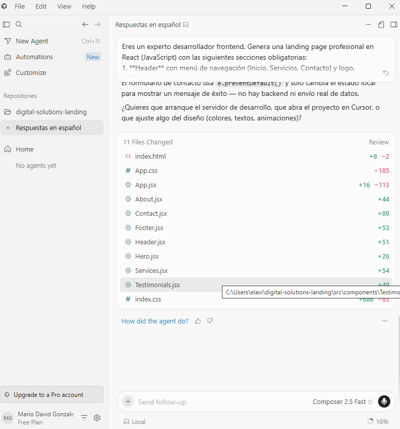
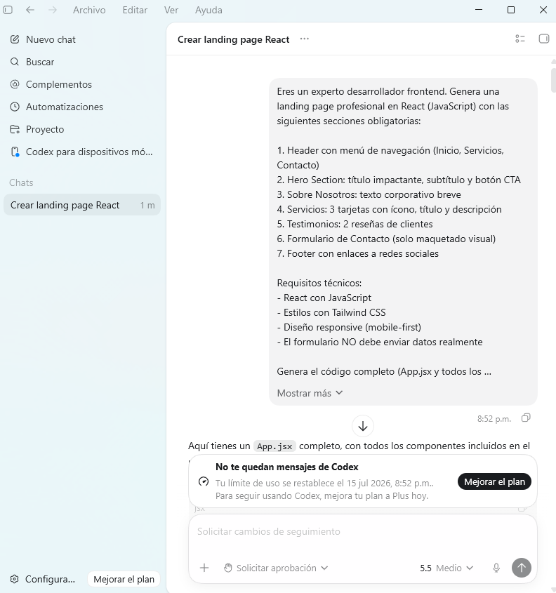

# Práctica Formativa Obligatoria 2

## Comparativa de Landing Pages con IA

## Datos del Estudiante
- **Nombre:** Mario David González Benítez
- **Comisión:** Lunes

## Objetivo

Diseñar y estructurar un único prompt inicial de alta precisión basado en
lineamientos oficiales para generar una Landing Page. Este prompt se ejecutará en dos agentes
de desarrollo de software para comparar su capacidad de resolución autónoma.

## Agentes de desarrollo elegidos

* Cursor
* Codex

## Limitaciones

El procedimiento exige no modificar el código de forma manual, permitiendo que el agente actúe
de manera autónoma para priorizar el análisis sobre el diseño del prompt inicial en lugar de la
iteración repetitiva. El resultado final de ambos agentes se integrará en un único despliegue con
una portada de acceso.

## Consigna

**1. Estructura del Prompt:** El prompt debe armarse siguiendo las recomendaciones y
buenas prácticas oficiales de diseño de instrucciones de los principales proveedores de
IA.

**2. Requisitos mínimos de la Landing Page a generar:**
* Cabecera (Header con menú de navegación).
* Hero Section (Sección principal con título impactante y botón de llamada a la acción - CTA).
* Descripción / Sobre Nosotros.
* Sección de Servicios o Características principales.
* Testimonios o Reseñas de clientes.
* Formulario de contacto (Maquetado visual, no requiere funcionalidad backend).
* Pie de página (Footer) con enlaces a redes sociales.

**3. Desarrollo y Restricciones:**
* Generar la Landing Page utilizando el mismo prompt en los dos agentes elegidos.
* Restricción estricta: No tocar nada de código manualmente. Dejar actuar al agente lo más posible para evaluar la efectividad de la instrucción inicial.

**4. Interfaz de Acceso (Portada):** El proyecto debe iniciar en una página de portada que
contenga tres accesos directos:
* Link 1: El texto plano del prompt utilizado.
* Link 2: Landing Page generada por el Primer Agente (especificando nombre del agente y modelo de lenguaje usado).
* Link 3: Landing Page generada por el Segundo Agente (especificando nombre del agente y modelo de lenguaje usado).

**5. Repositorio y Documentación:** Subir todo el código del proyecto a un único repositorio de GitHub. El archivo README.md del repositorio debe detallar obligatoriamente la siguiente información de forma clara:
* Datos del estudiante.
* Link al deploy unificado (un solo enlace de Vercel que dirija a la portada con las tres opciones).
* El prompt exacto utilizado.
* Capturas de pantalla de ambos sitios web generados.

## Link de la Portada del proyecto
* https://pfo2-react-weld.vercel.app/

# Cursor + Composer 2.5 Fast
* https://landing-cursor.vercel.app/

## Prompt Cursor
*Solo permitió un prompt por la limitación de tokens*

**1.** Eres un experto desarrollador frontend. Genera una landing page profesional en React (JavaScript) con las siguientes secciones obligatorias: Header con menú de navegación (Inicio, Servicios, Contacto), Hero Section: título impactante, subtítulo y botón CTA, Sobre Nosotros: texto corporativo breve, Servicios: 3 tarjetas con ícono, título y descripción, Testimonios: 2 reseñas de clientes, Formulario de Contacto (solo maquetado visual), Footer con enlaces a redes sociales. Requisitos técnicos: React con JavaScript, estilos con Tailwind CSS, diseño responsive mobile-first, el formulario NO debe enviar datos realmente. Genera el código completo (App.jsx y todos los componentes) listo para copiar y pegar.

## Capturas de Pantalla

### Prompt Cursor

### Home Cursor

# Codex + GPT 5.5
* https://landing-codex.vercel.app/

## Prompt Codex
*Permitió 13 prompts que ayudo a mejorar la landing page hasta la limitación de tokens*

**1.** Eres un experto desarrollador frontend. Genera una landing page profesional en React (JavaScript) con las siguientes secciones obligatorias: Header con menú de navegación (Inicio, Servicios, Contacto), Hero Section: título impactante, subtítulo y botón CTA, Sobre Nosotros: texto corporativo breve, Servicios: 3 tarjetas con ícono, título y descripción, Testimonios: 2 reseñas de clientes, Formulario de Contacto (solo maquetado visual), Footer con enlaces a redes sociales. Requisitos técnicos: React con JavaScript, estilos con Tailwind CSS, diseño responsive mobile-first, el formulario NO debe enviar datos realmente. Genera el código completo (App.jsx y todos los componentes) listo para copiar y pegar.

**2.** Puedes generar los archivos para descargarlos o guardarlos en una carpeta?

**3.** Abrí el proyecto en VS Code y ejecuté npm install y npm run dev. Cuando abro el link en navegador se ve en blanco y en la consola muestra este error: Uncaught ReferenceError: React is not defined.

**4.** Perfecto, ya funciona, no es necesario que crees el zip, puedo utilizar el código directamente. Podrías agregar animaciones a toda la página al hacer scroll tanto al bajar como al subir la página.

**5.** El footer no se está mostrando, hay forma de arreglar eso?

**6.** Podrías darle el color original a los íconos de LinkedIn, Instagram y Facebook.

**7.** Podrías agregar 3 tarjetas con precios "Básico", "Medio", "Pro", que se puedan seleccionar, que tengan un efecto hover, que sea muy visible pero manteniendo el estilo de la página.

**8.** Podrías agregar 4 testimonios más, pero que estén en la misma fila dentro de un carrusel.

**9.** Podrías agregar un modo oscuro.

**10.** Podrías agregar al navbar las secciones que faltan: Sobre Nosotros, Precios, Testimonios.

**12.** Me puedes crear un archivo HTML separado del proyecto, puede ser en la misma carpeta, con una lista de todos los prompts que te pasé, llamado prompt-codex.

**13.** Solo necesito los prompts, no necesito el código, eso ya lo tengo en React.

## Capturas de Pantalla

### Prompt Codex

### Home Codex

