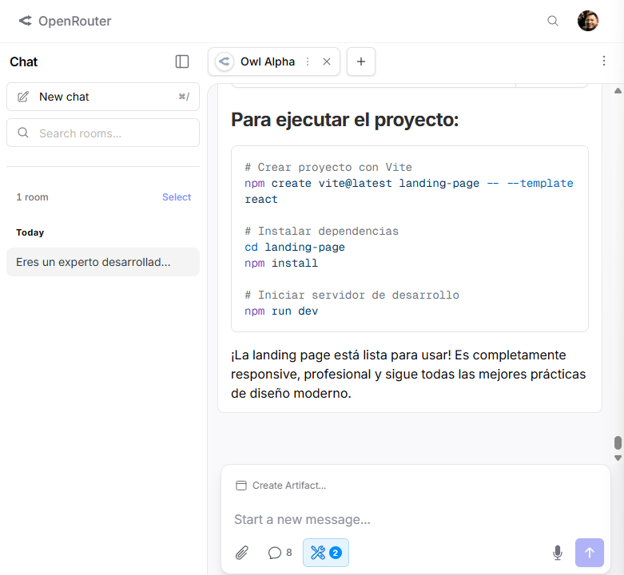

# PFO2 - Comparativa de Landing Pages con IA

## Datos del Estudiante
- **Nombre:** Mario David González
- **Comisión:** Lunes

## Link al Deploy
[Ver proyecto en Vercel](https://tu-link.vercel.app)

## Prompt Exacto Utilizado
[Pega aquí el texto completo del prompt]

## Agentes Utilizados

| Agente | Herramienta | Modelo | Costo |
|--------|-------------|--------|-------|
| Agente 1 | Cursor | IA integrada de Cursor | Gratis |
| Agente 2 | Claude Code | Claude Code vía OpenRouter | Gratis |

## Capturas de Pantalla

### Cursor

### Claude Code

## Comparativa

| Característica | Cursor | Claude Code |
|----------------|--------|-------------|
| Tiempo de generación | X segundos | X segundos |
| Calidad del diseño | ⭐⭐⭐⭐⭐ | ⭐⭐⭐⭐⭐ |
| Completitud del prompt | ✅/❌ | ✅/❌ |

## Conclusión
[Escribe aquí tu análisis]onfig.js